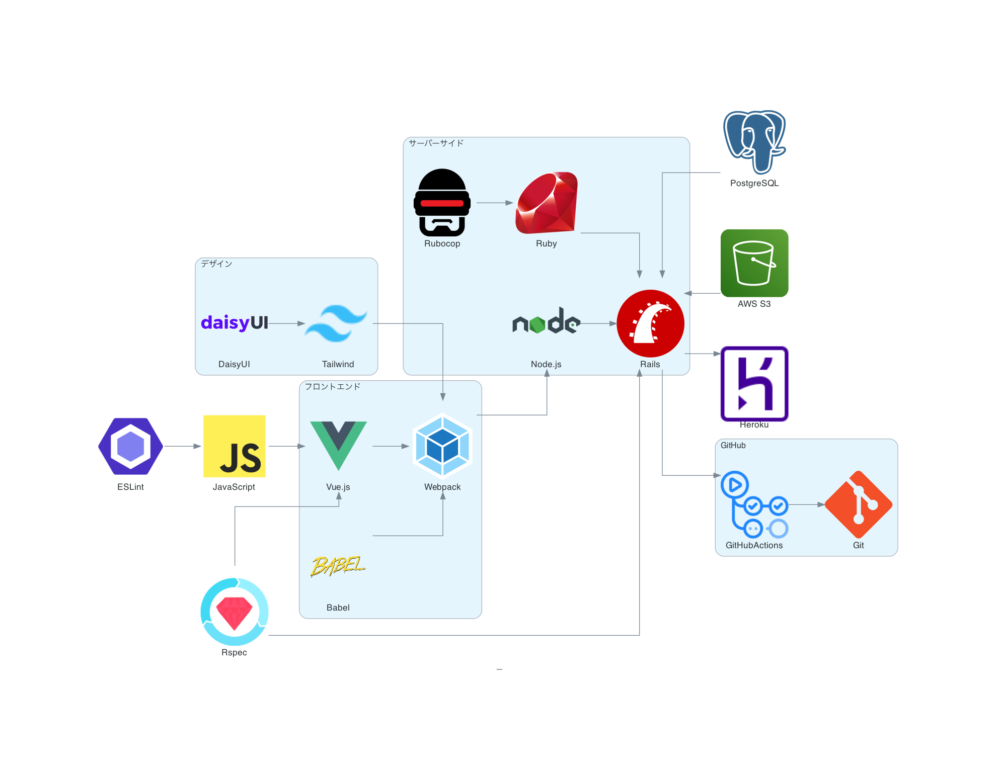

# Ruumarker 
（ルーマーカー）


## サイトリンク

https://ruumarker.herokuapp.com/

## サービス概要

引越しした時、不動産管理者に入居時の部屋の状況を報告するための書類を作成するためのサービスです。

キズの位置とその写真が載っている「入居時チェック表」を作成してPDFでダウンロードできます。

もし既にキズがあった場合に、自分の過失でないことをあらかじめ説明しておけば、不当な修繕費の請求を避けられるかもしれません。

## 利用方法

#### 手順

１．間取り画像をアップロードします

２．間取り図を編集します

３．キズ情報を追加します

４．PDFとしてダウンロードします

#### 作成イメージ


#### ヘルプページ

https://ruumarker.herokuapp.com/help

## 動作環境
- Ruby 3.1
- Rails 7.0
- Node.js 16.14

## サービス構成


## インストール

```shell
bin/setup
yarn
bin/dev
```
## Lint
```shell
# JavaScript
yarn lint 

# Ruby
bundle exec rubocop

# bundler-audit
bundle exec bundler-audit --update

# Brakeman
bundle exec brakeman -q -w2 
```

## テスト
```shell
bundle exec rspec
```

## AWS S3 設定
デプロイはHerokuを利用していますが、Herokuでの本番環境では、画像の保存先は`AWS S3`のバケットを利用します。

S3管理用のIAMユーザーの「access_key_id」「secret_access_key」を`rails credentials:edit`を利用して秘匿情報としてプロジェクトに保持します。

以下のコマンドから秘匿情報を編集して`credentials.yml.enc`ファイルに暗号化して保存することができます。
```shell
EDITOR="vi" bin/rails credentials:edit
```
```shell
# credentials.yml.enc
aws:
  access_key_id: #入力
  secret_access_key: #入力
```
この時、`config/credentials.yml.enc`と`config/master.key`が保存されていることを確認できます。`config/master.key`を公開しないように`.gitignore`に設定しています。

config下の秘匿情報は `config/storage.yml`にて読み込めるように設定されています。
```shell
access_key_id: <%= Rails.application.credentials.dig(:aws, :access_key_id) %>
secret_access_key: <%= Rails.application.credentials.dig(:aws, :secret_access_key) %>
```

Herokuでのデプロイ時には`master.key`を渡す必要があります。
```shell
heroku config:set RAILS_MASTER_KEY=`cat config/master.key`
```

## 付記
[production環境での実行（未検証）](https://github.com/kasai441/ruumarker/wiki/production環境での実行（未検証）)
