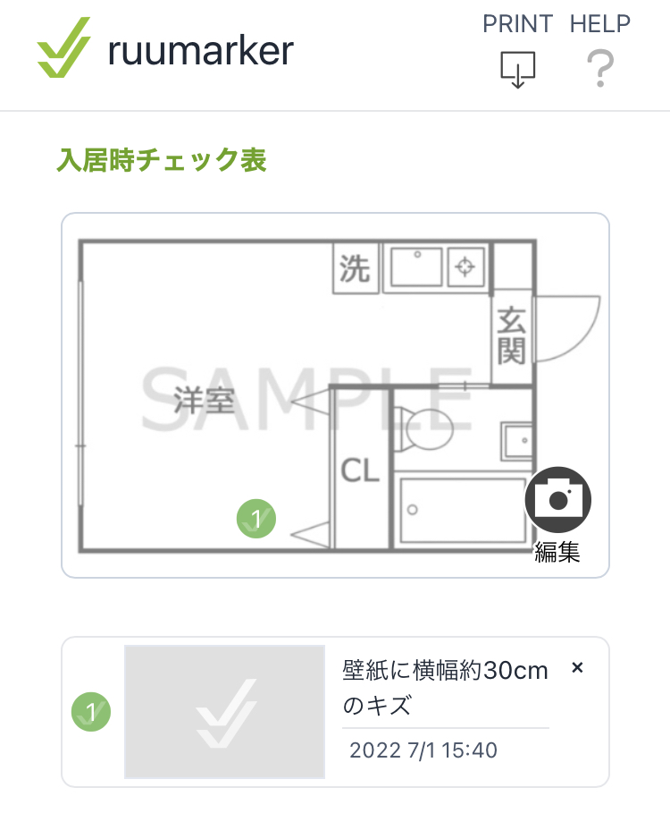

# Ruumarker 
（ルーマーカー）


## サイトリンク

https://ruumarker.herokuapp.com/

## サービス概要

引越しした時、不動産管理者に入居時の部屋の状況を報告するための書類を作成するためのサービスです。

キズの位置とその写真が載っている「入居時チェック表」を作成してPDFでダウンロードできます。

もし既にキズがあった場合に、自分の過失でないことをあらかじめ説明しておけば、不当な修繕費の請求を避けられるかもしれません。

## 利用方法

#### 手順

１．間取り画像をアップロードします

２．間取り図を編集します

３．キズ情報を追加します

４．PDFとしてダウンロードします

#### 作成イメージ



#### ヘルプページ

https://ruumarker.herokuapp.com/help

## 動作環境
- Ruby 3.1
- Rails 7.0
- Node.js 16.14

## サービス構成


## インストール

```shell
bin/setup
yarn
bin/dev
```
## Lint
```shell
# JavaScript
yarn lint 

# Ruby
bundle exec rubocop

# bundler-audit
bundle exec bundler-audit --update

# Brakeman
bundle exec brakeman -q -w2 
```

## テスト
```shell
bundle exec rspec
```

## 付記
[production環境での実行（未検証）](https://github.com/kasai441/ruumarker/wiki/production環境での実行（未検証）)
